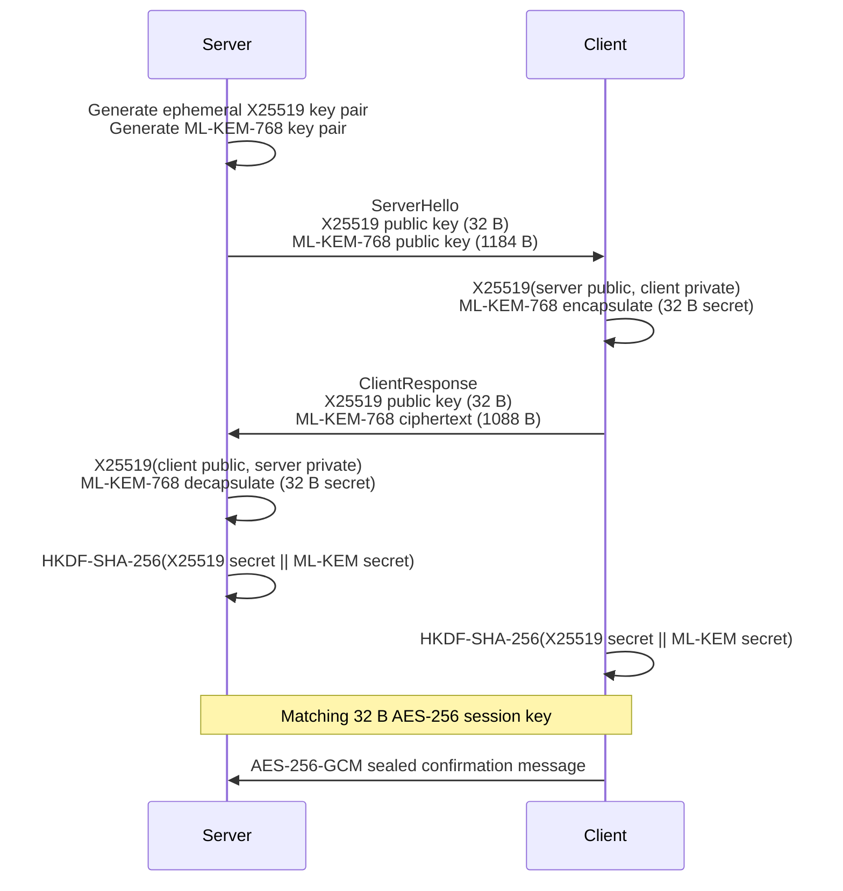
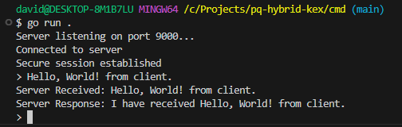

# pq-hybrid-kex

[](https://go.dev/)
[](https://csrc.nist.gov/pubs/fips/203/final)
[](https://doi.org/10.6028/NIST.FIPS.203)
[](LICENSE)

`pq-hybrid-kex` is a small, Go demonstration of hybrid post-quantum key exchange. It combines **ML-KEM-768** and **X25519**, derives an AES-256 key with HKDF-SHA-256, then proves key agreement with an AES-256-GCM encryption round trip.

## The problem: harvest now, decrypt later

An adversary can record encrypted traffic today and keep it until quantum computers are available. This is the **Harvest Now, Decrypt Later** threat. RSA and conventional elliptic-curve key exchange such as ECDH rely on mathematical problems that Shor’s algorithm can solve efficiently on a quantum computer. Recorded sessions whose secrets were protected only by those systems could then be decrypted.

## Why hybrid key exchange?

Hybrid exchange combines two independent shared secrets:

- **ML-KEM-768** supplies post-quantum resistance. It is the NIST-standardized ML-KEM parameter.
- **X25519** supplies widely deployed, well-understood classical elliptic-curve security.

The demo concatenates both 32-byte secrets as input key material and applies HKDF-SHA-256 with a fixed protocol context string. The resulting session key depends on both components.

## Why AES-256?

Grover’s algorithm is a quadratic speedup against brute-force symmetric keys. As a rough security-level rule, AES-128’s 128-bit classical brute-force margin becomes about 64 bits against a quantum search, while AES-256 has about 128 bits. This demo uses AES-256-GCM: 256-bit encryption keys plus authenticated encryption.

## Protocol flow



## Quickstart

### 1. Prerequisites
This project requires Go 1.24 or later for the `crypto/mlkem` standard library.
Check your version:
```bash
go version
```
If you have an older version, install the latest from the official source: https://go.dev/

### 2. Clone the repository
```bash
git clone https://github.com/Eklund2012/pq-hybrid-kex.git
cd pq-hybrid-kex
```
### 3. Install packages
```bash
go mod tidy
```
### 4. Run the program
```bash
cd cmd
go run main.go
```
The server will start listening and the client will prompt for input.

### Output when running the code


## References

- [NIST FIPS 203: Module-Lattice-Based Key-Encapsulation Mechanism Standard](https://doi.org/10.6028/NIST.FIPS.203)
- [RFC 7748: Elliptic Curves for Security (X25519)](https://www.rfc-editor.org/rfc/rfc7748)
- [RFC 5869: HMAC-based Extract-and-Expand Key Derivation Function (HKDF)](https://www.rfc-editor.org/rfc/rfc5869)
- [NIST SP 800-38D: Recommendation for Block Cipher Modes of Operation: Galois/Counter Mode (GCM)](https://csrc.nist.gov/pubs/sp/800/38/d/final)
- [Go `crypto/mlkem` Documentation](https://pkg.go.dev/crypto/mlkem)
- [Go `crypto/hkdf` Documentation](https://pkg.go.dev/crypto/hkdf)